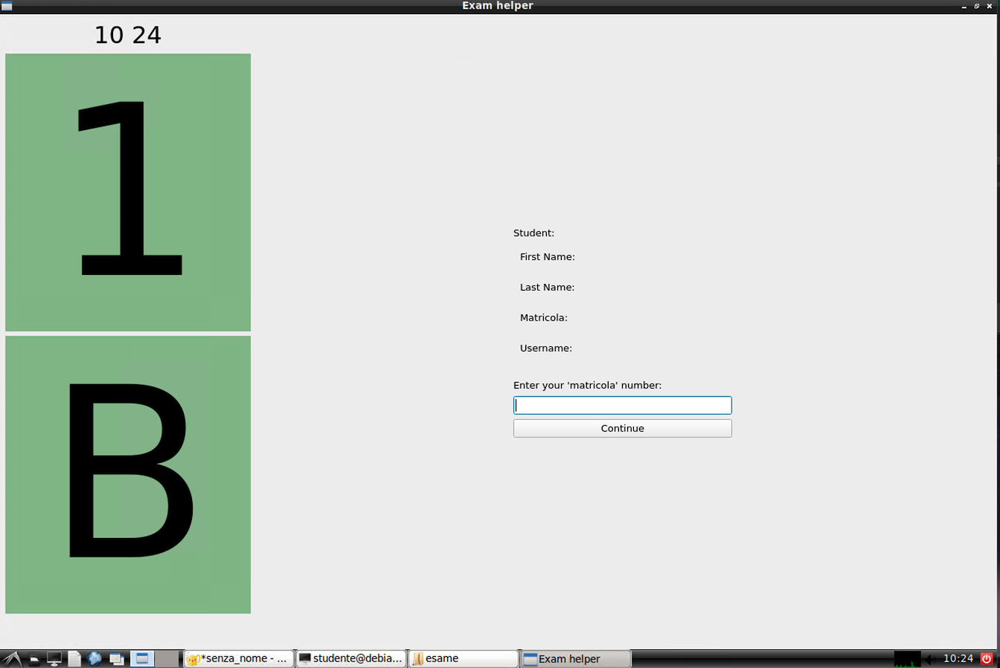
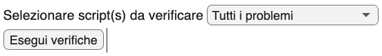

# Fasi dell'esame
<!-- omit from toc -->

## Operazioni preliminari

### La convocazione

La convocazione avviene di norma entro due giorni feriali dopo la chiusura delle
prenotazioni ed è inviata via email agli studenti che si sono prenotati su Infostud.
Nella convocazione sono contenuti:

- l'orario di inizio dell'esame (quello riportato su infostud è indicativo)
- l'aula in cui si svolgerà l'esame (di norma a Via Tiburtina 205)
- l'incoraggiamento a leggere queste istruzioni
- l'invito, in caso di impossibilità a presentarsi all'esame, a darne comunicazione ai
  docenti

### La postazione di lavoro

L'accesso all'aula d'esame è consentito nei **10 minuti precedenti l'orario di
inizio della prova**. Si raccomanda la puntualità, sia per consentire che le
operazioni preliminari siano completate senza ritardi che per non perdere
eventuali comunicazioni dei docenti.

L'assegnazione delle postazioni di lavoro è proiettata sugli schermi
dell'aula.
In caso di dubbi, è opportuno chiedere assistenza ai docenti.

La postazione è individuata da un numero e una lettera, ad esempio `1-A`, `2-C`,
etc. Il numero indica la fila, a partire dalla cattedra. La lettera indica la
postazione all'interno della fila, a partire da sinistra.

L'identificativo di ciascuna postazione è anche sullo schermo del computer, nella schermata dell'applicazione _Exam helper_. Muovere il mouse se il salvaschermo è attivo.

!!! warning "Attenzione"
    Lo studente è tenuto ad occupare la postazione indicata e ogni cambio
    di postazione deve essere autorizzato da un docente.

È necessario tenere un **documento di identità** sulla scrivania, mentre andranno rimossi
tutti gli oggetti non necessari.  
Gli **oggetti consentiti** includono penna/matita, bottiglia d'acqua,
medicinali. Gli astucci dovranno essere riposti nello zaino/borsa. Il telefonino
dovrà essere spento e riposto riporlo nello zaino/borsa. I fogli di carta
(bianchi) saranno forniti dai docenti.

Zaini, borse e giacche devono essere fuori portata, ad esempio in prossimità del muro.

!!! warning "Attenzione"  
    Essere colti durante lo svolgimento della prova con oggetti non
    consentiti comporta potenzialmente l'esclusione dalla prova.

    Si raccomanda attenzione per evitare che azioni magari innocue, come ad esempio
    indossare un orologio smart, possano essere interpretate come tentativi di ottenere
    un vantaggio illecito.

Una volta avviata la prova, non sarà permesso lasciare la postazione fino a quando non
si sarà consegnato lo svolgimento. Si invita a essere previdenti e utilizzare
saggiamente il tempo che precede l'avvio della prova e la pausa.

### Identificazione studente

L'identificazione avviene in due fasi:

1. appena lo studente prende posto nella postazione assegnata
2. quando il docente verifica il documento di identità

La prima fase avviene tramite l'applicazione _Exam helper_, che è già avviata sulla postazione
e consente di inserire la propria matricola e confermare la propria identità.

!!! tip
    Se l'applicazione _Exam helper_ non è già avviata, è possibile farlo
    utilizzando lo script `start-examhelper.sh` presente nella cartella `esame` sul desktop (doppio click e poi scegliere _Esegui_).

Il documento di identità dovrà rimanere sulla scrivania durante la prova, in modo che i
docenti possano verificarlo senza interrompere lo svolgimento.

## Parte 1: Problemi in ambiente Matlab

Le modalità di svolgimento sono analoghe a quelle descritte durante le
esercitazioni. È importante avere cognizione dell'elenco dei nomi delle
variabili a cui è richiesto che siano assegnati i risultati, descritto
nella traccia. La traccia contiene anche indicazioni sulla forma
(scalare, vettore colonna, etc.) che deve assumere la variabile.

### Avvio della prova

!!! warning "Attenzione"  
    Non avviare Matlab manualmente, ma seguire le istruzioni di seguito.  
    Infatti, se avviato manualmente Matlab non sarà configurato correttamente
    e non sarà possibile svolgere i problemi.  
    Se il Matlab è già avviato, chiuderlo prima di procedere.

Cliccando il pulsante "_Avvia Problemi in Matlab_" nell'applicazione `Exam
helper` si avvierà e configurerà correttamente Matlab in modo che sia possibile
svolgere i problemi senza ulteriori operazioni manuali.

In dettaglio, l'_Exam helper_:

- imposta la sottocartella `MAADB_Part1` presente nella cartella `esame` sul
  desktop come cartella di lavoro del Matlab
- configura il path del Matlab per rendere disponibile il toolbox di verifica formale degli
  svolgimenti
- rinomina i file `problema*_MATRICOLA.m` per includere il
  numero di matricola dello studente
- apre nell'editor gli script descritti al punto precedente
- avvia il _live script_ `check_exam.mlx`, che consente di
  verificare lo stato di avanzamento dello svolgimento e di eseguire le
  verifiche formali sulle variabili.

Per avviare lo script, è sufficiente un doppio click su di esso nella
cartella `MAADB_Part1` presente nella cartella `esame` sul desktop, e confermare
che si desidera eseguire lo script.

!!! tip "Procedura alternativa"  
    Se la procedura automatica non andasse a buon
    fine, è sempre possibile avviare manualmente il Matlab e seguire le
    istruzioni riportate nella sezione dell'Appendice "_Malfunzionamento della
    procedura automatica di avvio dei problemi in Matlab_".

### Verifica formale degli svolgimenti

Il tool di verifica formale è un _live script_ che automatizza le
verifiche su nomi e sulla forma delle variabili, e fornisce
all'esaminando un report sullo stato di completamento dell'esame.

Questo tool viene aperto automaticamente all'avvio del Matlab. Alternativamente,
può essere lanciato dalla _Command Window_ digitando 'edit check_exam' (seguito
dal tasto INVO).

Durante lo svolgimento dell'esame, si potranno eseguire
le verifiche sulle variabili e sulle figure generate dal proprio svolgimento. È
possibile limitare la verifica a uno solo degli script, oppure
verificare entrambi.

Si raccomanda che queste verifiche siano eseguite
_ripetutamente_, per esempio dopo il completamento di
ciascun quesito che compone il problema.

Durante lo svolgimento dell'esame dovranno essere eseguite **almeno una
volta** tutte le verifiche formali.

!!! tip "In caso di errori del tool di verifica"  
    Può accadere che il tool di verifica emetta messaggi di errore
    inattesi se durante l'esame è stato eseguito un 'clear all'
    nella _Command Window_. In questo caso è sufficiente eseguire per intero
    il _live script_ di verifica utilizzando il pulsante RUN di Matlab.

### Suggerimenti per lo svolgimento dei problemi

### Consegna degli svolgimenti

Al termine dello svolgimento dei problemi, si dovrà cliccare sul pulsante
"_Consegna Problemi in Matlab_" nell'applicazione _Exam helper_.

Una pagina di conferma della consegna si aprirà nel browser, contenente il testo
dei file consegnati.

### Punteggio

Il punteggio massimo attribuito alla prova in Matlab è di 12 punti.

Il punteggio massimo attribuito a ciascun quesito è riportato nella
traccia del problema.

### Tempo

Il tempo a disposizione per la prova è di 90 minuti.

## Parte 2: Quesiti

Analogamente ai problemi in Matlab, anche per la Parte 2 dell'esame
l'applicazione _Exam helper_ automatizza il processo di avvio della prova e
consegna degli svolgimenti.

Cliccando il pulsante "_Avvia quesiti a risposta chiusa_" o "_Avvia quesiti a
risposta aperta_", il corrispondente file pdf contenenti i quesiti si aprirà nel
browser Firefox, mentre i file di testo per lo svolgimento si apriranno nell'editor di
testo Geany.

!!!tip "Se le righe non tornano a capo automaticamente"  
    Di default, l'editor Geany visualizza i file di testo senza tornare a capo una volta raggiunto
    il margine destro dello schermo. Si consiglia di selezionare il menu **Documento** >
    **A capo automatico** come descritto in [questa sezione](./os-and-software.md#geany-editor-di-testo).

!!!warning "Molto, molto importante"
    Durante lo svolgimento dell'esame salvare frequentemente i file txt (scorciatoia da tastiera:
    `CTRL+S`).

Prima della consegna verificare scrupolosamente che il contenuto dei file (salvati)
rifletta quanto si intende consegnare. La valutazione terrà conto esclusivamente del contenuto dei file txt
salvati nella cartella `esame/MAADB_Part2` al momento del ritiro degli elaborati.

### Quesiti a risposta chiusa

#### Avvio della prova (rchiusa)

Cliccando il pulsante "Avvia Quesiti a Risposta Chiusa", l'applicazione _Exam helper_ procederà a:

- rinominare il file `rchiusa_MATRICOLA.txt` sostituendo 'MATRICOLA' con il proprio numero di matricola
- aprire il file `rchiusa_quesiti.pdf` nel browser Firefox
- aprire il file rinominato `rchiusa_<matricola>.txt` nell'editor Geany

#### Svolgimento dei quesiti a risposta chiusa

Una volta aperto il file `rchiusa_MATRICOLA.txt`:

- **Leggere con attenzione** le istruzioni sintetiche contenute all'inizio del file
`rchiusa_<matricola>.txt`.
- Inserire il proprio **cognome e numero di matricola** nello spazio predisposto.

Si sottolinea che lo spazio per "commenti" non è previsto per estendere la
risposta, ma per segnalare eventuali ambiguità della domanda e
comunicare la propria interpretazione.

Tutti i quesiti hanno lo stesso valore _V_, ottenuto dividento il punteggio
massimo per il numero di quesiti.

- Ogni risposta corretta aggiunge _V_ punti al voto.
- Ogni risposta sbagliata **sottrae** _V/2_ punti al voto.
- Le risposte non date non modificano il voto.

### Consegna delle risposte ai quesiti a risposta chiusa

Al termine del tempo a disposizione (60 minuti dall'inizio della Parte
2), salvare definitivamente e chiudere l'editor Geany.

!!!tip "Consegna in anticipo"  
    E' possibile consegnare le risposte ai quesiti a risposta chiusa
    anche prima della scadenza, ad esempio per avere più tempo da dedicare
    alla risposta aperta.

Nell'applicazione _Exam helper_ cliccare il pulsante "_Consegna quesiti a
risposta chiusa_" . Si aprirà nel browser una pagina di conferma della consegna,
contenente il testo dei file consegnati.

### Quesiti a risposta aperta

#### Avvio della prova (raperta)

Cliccando il pulsante "_Avvia quesito a risposta aperta_", l'applicazione `Exam
helper` procederà a:

- rinominare il file `raperta_MATRICOLA.txt` sostituendo 'MATRICOLA' con il proprio numero di matricola
- aprire il file `raperta_quesiti.pdf` nel browser predefinito
- aprire il file rinominato `raperta_<matricola>.txt` nell'editor Geany

#### Svolgimento del quesito a risposta aperta

La traccia (file pdf) contiene anche:

- Il numero di caratteri massimo consentito per la risposta
- I criteri di valutazione che saranno utilizzati per attribuire il punteggio
  allo svolgimento.

L'elaborazione della risposta aperta potrà iniziare immediatamente dopo
aver completato le risposte chiuse, anche prima che sia esaurito il
tempo a disposizione per queste ultime.

!!!tip "Controllo del numero di caratteri"
    È possibile verificare il numero di caratteri dello svolgimento
    nella barra di stato nell'editor Geany, dopo aver selezionato il testo.
    Ulteriori informazioni sono disponibili nella
    [sezione dedicata](./os-and-software.md#geany-editor-di-testo).

#### Consegna della risposta aperta

Al termine del tempo a disposizione (120 minuti dall'inizio della Parte
2), salvare definitivamente e chiudere l'editor Geany.

Nell'applicazione _Exam helper_ cliccare il pulsante "_Consegna quesito a
risposta aperta_" . Si aprirà nel browser una pagina di conferma della consegna
contenente il testo dei file consegnati.

## Conclusione dell'esame

L'esame si conclude chiudendo tutti i file, le applicazioni e le
cartelle utilizzati durante l'esame. Ai fini della valutazione faranno
fede gli svolgimenti presenti nella cartella 'esame', che saranno
ritirati allo scadere del tempo messo a disposizione.

Sia durante la Parte 1 che la Parte 2 è possibile conegnare in anticipo e
lasciare l'aula d'esame, purché sia già stata effettuata la verifica del
documento di identità. È comunque richiesto di che l'intenzione di lasciare
l'aula venga segnalata ad un docente.

Se si intende ritirarsi dall'esame è necessario che nel compito sia
stata esplicitamente registrata questa scelta e che un docente ne sia
stato informato.

In caso di **rinuncia** all'esame, all'interno del file dello svolgimento
(file .m oppure .txt) dovrà apparire la parola "**RITIRATO/A**" subito sotto
il proprio cognome/matricola.
