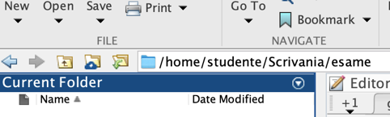

# Istruzioni per gli studenti che sostengono l'esame di MAADB

## Checklist <!-- omit from toc -->

- [ ] So come individuare la mia postazione di lavoro
- [ ] So cosa posso tenere con me durante l'esame
- [ ] So che tra l'inizio della prova e la consegna non potrò lasciare la postazione
- [ ] So che per avviare e poi per consegnare ciascuna prova dovrò eseguire uno script
  (file `.sh`), e so in che cartella si trova ciascuno di questi script
- [ ] So utilizzare il notebook di verifica formale `check_exam.mlx` in Matlab
- [ ] Sono consapevole allo scadere del tempo di ciascuna prova il contenuto della
  cartella `esame` verrà prelevato da remoto e che non saranno valutati eventuali file
  non ancora salvati
- [ ] So che se dovessi decidere di ritirarmi dall'esame dovrò indicarlo chiaramente

## Sommario <!-- omit from toc -->

<!-- BUG? The syle for level 1 and level 2 TOC entries is the same
          If Header 1 is excluded, then the layout of the TOC is mostly flat (Headers 2 and 3)
  -->

- [Istruzioni per gli studenti che sostengono l'esame di MAADB](#istruzioni-per-gli-studenti-che-sostengono-lesame-di-maadb)
  - [Struttura dell'esame](#struttura-dellesame)
    - [Punteggio](#punteggio)
  - [Le istruzioni in breve](#le-istruzioni-in-breve)
  - [Operazioni preliminari](#operazioni-preliminari)
    - [La convocazione](#la-convocazione)
    - [La postazione di lavoro](#la-postazione-di-lavoro)
    - [Identificazione studente](#identificazione-studente)
  - [Parte 1: Problemi in ambiente Matlab](#parte-1-problemi-in-ambiente-matlab)
    - [Startup](#startup)
    - [Exam checker](#exam-checker)
    - [Indicazioni per lo svolgimento dei problemi (?)](#indicazioni-per-lo-svolgimento-dei-problemi-)
    - [Punteggio](#punteggio-1)
    - [Tempo](#tempo)
  - [Parte 2: Quesiti](#parte-2-quesiti)
    - [Quesiti a risposta chiusa](#quesiti-a-risposta-chiusa)
    - [Quesiti a risposta aperta](#quesiti-a-risposta-aperta)
  - [Conclusione dell'esame](#conclusione-dellesame)
  - [Risorse per lo svolgimento dell'esame](#risorse-per-lo-svolgimento-dellesame)
    - [La cartella condivisa 'esami'](#la-cartella-condivisa-esami)
    - [Le applicazioni da utilizzare](#le-applicazioni-da-utilizzare)
      - [Matlab](#matlab)
      - [Geany (editor di testo)](#geany-editor-di-testo)
      - [xPDF (visualizzatore di file pdf)](#xpdf-visualizzatore-di-file-pdf)
      - [galculator (calcolatrice)](#galculator-calcolatrice)
  - [Appendice - Risoluzione problemi tecnici](#appendice---risoluzione-problemi-tecnici)
    - [Creazione manuale file di svogimento da template](#creazione-manuale-file-di-svogimento-da-template)
    - [Malfunzionamento dello script avvia-problemi.sh](#malfunzionamento-dello-script-avvia-problemish)
      - [1. Avvio Matlab](#1-avvio-matlab)
      - [2. Impostazione della cartella di lavoro](#2-impostazione-della-cartella-di-lavoro)
      - [3. Configurazione del toolbox di verifica formale](#3-configurazione-del-toolbox-di-verifica-formale)
    - [Malfunzionamento dello script avvia-rchiusa.sh e/o avvia-raperta.sh](#malfunzionamento-dello-script-avvia-rchiusash-eo-avvia-rapertash)
    - [Malfunzionamento degli scritpt di consegna](#malfunzionamento-degli-scritpt-di-consegna)
    - [Come aprire manualmente i file pdf](#come-aprire-manualmente-i-file-pdf)
    - [Come aprire manualmente i file txt](#come-aprire-manualmente-i-file-txt)
  - [Struttura della cartella 'esame'](#struttura-della-cartella-esame)

## Struttura dell'esame

L'esame si compone di tre prove:

1. problemi in ambiente Matlab (da svolgersi nella Parte 1)
2. quesiti a risposta chiusa (da svolgersi nella Parte 2)
3. quesito a risposta aperta (da svolgersi nella Parte 2)

Le prove sono svolte in sequenza con una breve pausa tra la Parte 1 e la Parte 2:

La durata della Parte 1 è di 90 minuti.

La durata della Parte 2 è di 120 minuti, di cui si possono utilizzare al massimo 60
minuti per i quesiti a risposta chiusa.

### Punteggio

| Prova                          | Punteggio massimo |
|--------------------------------|-------------------|
| Problemi in Matlab             | 12/30             |
| Quesiti a risposta chiusa      | 16/30             |
| Quesito a risposta aperta      | 4/30              |
| **Totale**                     | **32/30**         |

Riceverà la lode chi otterrà un punteggio non inferiore a 31/30.

Maggiori dettagli sono riportati nelle sezioni dedicate a ciascuna prova.

## Le istruzioni in breve

In estrema sintesi, l'esame prevede che gli studenti seguano questa procedura:

1. Arrivare in aula in anticipo rispetto all'orario di inizio dell'esame, per consentire
   di completare le operazioni preliminari. Portare con sé un documento di identità.
2. Individuare la propria postazione di lavoro nell'elenco proiettato sugli schermi
   dell'aula. Tenere con sé solo un documento di identità e altri oggetti strettamente
   necessari, mentre tutti gli altri oggetti devono essere riposti fuori dalla portata.
3. Inserire la propria matricola nella maschera di identificazione presente sulla app
   `Tiburexam`.
4. Attendere la distribuzione dei file nella cartella `esame` presente sul desktop.
   Entrare nella sottocartella `MAADB_Part1`.
5. Eseguire (doppio click) lo script `avvia-problemi.sh`, che avvierà il Matlab.
   Svolgere i problemi, assistendosi con il tool di verifica formale `check_exam.mlx`.
6. Completato lo svolgimento dei problemi, salvare i file e chiudere il Matlab. Eseguire
   (doppio click) il file `consegna-problemi.sh` per consegnare lo svolgimento.
7. Dopo la pausa, ripetere i punti precedenti per la Parte 2 dell'esame:

    1. entrare nella sottocartella `MAADB_Part2`
    2. eseguire lo script `avvia-rchiusa.sh` per aprire i file dei quesiti a risposta
       chiusa e lo script `consegna.rchiusa.sh` per consegnare le risposte
    3. eseguire lo script `avvia-raperta.sh` per aprire i file del quesito a risposta
       aperta e lo script `consegna-raperta.sh` per consegnare le risposte

8. Al termine dell'esame, lasciare l'aula in silenzio oppure, se mancano meno di 10
   minuti allo scadere del tempo, attendere alla propria postazione.

Nel resto del documento sono fornite le istruzioni dettagliate per ciascuna di queste
operazioni e indicazioni per la risoluzione di eventuali problemi.

Si presuppone che gli studenti che sostengono l'esame abbiano già letto questo
documento.

## Operazioni preliminari

### La convocazione

La convocazione avviene di norma entro due giorni feriali dopo la chiusura delle
prenotazioni ed è inviata via email agli studenti che si sono prenotati su Infostud.
Nella convocazione sono contenuti:

- l'orario di inizio dell'esame (quello riportato su infostud è indicativo)
- l'aula in cui si svolgerà l'esame (di norma a Via Tiburtina 205)
- l'incoraggiamento a leggere queste istruzioni
- l'invito, in caso di impossibilità a presentarsi all'esame, a darne comunicazione ai
  docenti

### La postazione di lavoro

L'accesso all'aula d'esame è consentito nei 10 minuti precedenti l'orario di inizio
della prova. Si raccomanda presentarsi almeno con questo anticipo, sia per consentire
che le operazioni preliminari siano completate senza ritardi che per non perdere
eventuali comunicazioni.

Di norma, l'assegnazione delle postazioni di lavoro è proiettata sugli schermi
dell'aula. (In alcuni casi, potrebbe essere stampata ed affissa sulla porta d'ingresso.)
In caso di dubbi, è consigliabile chiedere assistenza ai docenti.

La postazione è individuata da un numero e una lettera, ad esempio "1A", "2C", etc. Il
numero indica la fila, a partire dalla cattedra. La lettera indica la postazione nella
fila, a partire da sinistra.

!!! warning "Attenzione"
    Lo studente è tenuto ad occupare la postazione indicata e ogni cambio
    di postazione deve essere autorizzato da un docente.

È necessario tenere un documento di identità sulla scrivania, mentre andranno rimossi
tutti gli oggetti non necessari. Gli elementi consentiti includono
penna/matita, bottiglia d'acqua, medicinali. Gli astucci dovranno essere riposti nello
zaino/borsa. Il telefonino dovrà essere spento e riposto riporlo nello zaino/borsa. I
fogli di carta (bianchi) saranno forniti dai docenti.

Zaini, borse e giacche devono essere fuori portata, ad esempio in prossimità del muro.

!!! warning "Attenzione"  
    Essere colti durante lo svolgimento della prova con oggetti non
    consentiti comporta potenzialmente l'esclusione dalla prova.

    Si raccomanda attenzione per evitare che azioni magari innocue, come ad esempio
    indossare un orologio smart, possano essere interpretate come tentativi di ottenere
    un vantaggio illecito.

Una volta avviata la prova, non sarà permesso lasciare la postazione fino a quando non
si sarà consegnato lo svolgimento. Si invita a essere previdenti e utilizzare
saggiamente il tempo che precede l'avvio della prova e la pausa.

### Identificazione studente

L'identificazione avviene in due fasi:

1. appena lo studente prende posto nella postazione assegnata
2. quando il docente verifica il documento di identità

La prima fase avviene tramite l'applicazione Tiburexam, che è già avviata sulla postazione
e consente di inserire la propria matricola e confermare la propria identità.

!!!todo
     

!!! tip
    Se l'applicazione Tiburexam non è già avviata, è possibile farlo
    utilizzando lo script `start-exam.sh` presente nella cartella `esame` sul desktop.

Il documento di identità dovrà rimanere sulla scrivania durante la prova, in modo che i
docenti possano verificarlo senza interrompere lo svolgimento.


## Parte 1: Problemi in ambiente Matlab

Le modalità di svolgimento sono analoghe a quelle descritte durante le
esercitazioni. È importante avere cognizione dell'elenco dei nomi delle
variabili a cui è richiesto che siano assegnati i risultati, descritto
nella traccia. La traccia contiene anche indicazioni sulla forma
(scalare, vettore colonna, etc.) che deve assumere la variabile.

### Startup

Prima di aprire gli m-file contenenti le tracce d'esame, è necessario
applicare alcune configurazioni all'ambiente Matlab lanciando il comando
"startup_exam".

A questo fine, digitare startup_exam nella *command window*, seguito dal
tasto INVIO.

(In alternativa, aprire il m-file startup_exam.m nell'editor e cliccare
sull'icona 'Run')

Al termine dell'esecuzione, verrà aperto automaticamente il *live
script* descritto nella sezione seguente

### Exam checker

Il tool di verifica formale è un *live script* che automatizza le
verifiche su nomi e sulla forma delle variabili, e fornisce
all'esaminando un report sullo stato di completamento dell'esame.

Questo tool viene lanciato automaticamente una volta eseguito
'startup_exam'. Alternativamente, può essere lanciato dalla *command
line* digitando 'edit check_exam' (seguito dal tasto INVO).

Alla prima esecuzione è necessario digitare nel campo predisposto la
propria matricola. A seguire si dovrà verificare la corretta
denominazione dei file degli script contenenti lo svolgimento dei
problemi (pulsante 'Verifica files').

{width="2.4305555555555554in"
height="0.7916666666666666in"}

Successivamente, durante lo svolgimento dell'esame, si potranno eseguire
le verifiche sulle variabili e sulle figure generate dallo script. È
possibile limitare la verifica a uno solo degli script, oppure
verificare entrambi.

{width="3.8333333333333335in"
height="0.5694444444444444in"}

Si raccomanda che queste verifiche siano eseguite
[ripetutamente,]{.underline} per esempio dopo il completamento di
ciascun quesito che compone il problema.

Durante lo svolgimento dell'esame dovranno essere eseguite [almeno una
volta]{.underline} tutte le verifiche formali.

Può accadere che il tool di verifica emetta [messaggi di errore
inattesi]{.underline} se durante l'esame è stato eseguito un 'clear all'
nella *command window*. In questo caso è sufficiente eseguire per intero
il *live script* di verifica utilizzando il pulsante RUN di Matlab.

Al termine dell'esame, il tool consente (ancora solo a titolo
sperimentale) di gestire la consegna. Un eventuale errore emesso in
questa procedura [non pregiudica]{.underline} la corretta consegna
dell'elaborato.

### Indicazioni per lo svolgimento dei problemi (?)

{width="6.5in"
height="3.6666666666666665in"}

### Punteggio

Il punteggio massimo attribuito alla prova in Matlab è di 12 punti.

Il punteggio massimo attribuito a ciascun quesito è riportato nella
traccia del problema.

### Tempo

Il tempo a disposizione per la prova è di 90 minuti.

(segue)

## Parte 2: Quesiti

Analogamente ai file Matlab, prima di iniziare la prova è necessario
rinominare i file .txt, sostituendo il proprio numero di matricola al
segnaposto MATRICOLA.

È sufficiente un [doppio click]{.underline} per aprire nell'applicazione
*Visual Studio Code* i file:

MAADB_2024-09_rchiusa\_*\<matricola\>*.txt\
MAADB_2024-09_raperta\_*\<matricola\>*.txt

È necessario modificare la visualizzazione (menu **View -\> Word
Wrap**), in modo che raggiunto il margine destro il periodo prosegua
sulla riga successiva invece di proseguire sulla medesima linea.

Durante lo svolgimento dell'esame [salvare frequentemente]{.underline} i
file txt (scorciatoia da tastiera: CTRL+S). Al termine della prova
verificare scrupolosamente che il contenuto dei file (salvati) rifletta
quanto si intende consegnare, per esempio chiudendo e riaprendo i file.

La valutazione terrà conto esclusivamente del contenuto dei file txt
salvati nella cartella 'esame' al momento del ritiro degli elaborati.

### Quesiti a risposta chiusa

La traccia (file pdf) e il template dello svolgimento (file txt)
contengono ulteriori istruzioni per la compilazione delle risposte. Si
sottolinea che lo spazio per "commenti" non è previsto per estendere la
risposta, ma per segnalare eventuali ambiguità della domanda e
comunicare la propria interpretazione.

Al termine del tempo a disposizione (60 minuti dall'inizio della Parte
2), salvare definitivamente e chiudere il file.

Il punteggio massimo attribuito ai quesiti a risposta chiusa è XX punti.
Tutti i quesiti hanno lo stesso valore, ottenuto dividento il punteggio
massimo per il numero di quesiti, pari a V. Ogni risposta corretta
aggiunge V al punteggio. Le risposta non date non contribuiscono al
punteggio. Ogni risposta sbagliata sottrae V/2 al punteggio.

Eventuali modifiche apportate successivamente non saranno valutate.

### Quesiti a risposta aperta

La traccia (file pdf) contiene i criteri di valutazione che saranno
utilizzati per attribuire il punteggio allo svolgimento.

L'elaborazione della risposta aperta potrà iniziare immediatamente dopo
aver completato le risposte chiuse, anche prima che sia esaurito il
tempo a disposizione per queste ultime.

E' possibile verificare il numero di caratteri dello svolgimento \...

Al termine del tempo a disposizione (120 minuti dall'inizio della Parte
2), salvare definitivamente chiudere il file, assicurandosi di aver
salvato le modifiche.

## Conclusione dell'esame

L'esame si conclude chiudendo tutti i file, le applicazioni e le
cartelle utilizzati durante l'esame. Ai fini della valutazione faranno
fede gli svolgimenti presenti nella cartella 'esame', che saranno
ritirati allo scadere del tempo messo a disposizione.

Sia durante la Parte 1 che la Parte 2 è possibile lasciare in anticipo
l'aula d'esame, purché sia già stata effettuata la verifica del
documento di identità. È comunque richiesto di che l'intenzione di
lasciare l'aula venga segnalata ad un docente.

Se si intende ritirarsi dall'esame è necessario che nel compito sia
stata esplicitamente registrata questa scelta e che un docente ne sia
stato informato.

In caso di **rinuncia** all'esame, sulla [prima riga dei
file]{.underline} da consegnare (file .m oppure .txt) dovrà apparire
esclusivamente la parola "**RITIRATO**" (o "RITIRATA").

(segue)

## Risorse per lo svolgimento dell'esame

### La cartella condivisa 'esami'

I file necessari per lo svolgimento della prova si troveranno nella cartella `esame`, di
cui è presente un link sul desktop.


All'inizio dell'esame, la cartella conterrà:

- una copia di questo documento in formato pdf (`istruzioni.pdf`).
- Il formulario (`MAADB cheat sheet <versione>.pdf`)
- le tavole statistiche (`tavole_z_t_chi2_F.pdf`)

Inoltre, la cartella contiene uno script per avviare l'applicazione *Tiburexam*
(`start-exam.sh`). **Nota bene**: di norma l'applicazione *Tiburexam* è già avviata. Lo
script serve per riavviarla in caso di chiusura accidentale.

Le tracce verranno distribuite mediante il server dell'aula e appariranno
nella cartella pochi secondi dopo la distribuzione (che verrà chiaramente annunciata dal
docente). Trattandosi di una condivisione di rete, il file manager potrebbe richiedere
un aggiornamento manuale della visualizzazione del contenuto della cartella, utilizzando
il menu `Visualizza > Ricarica cartella`

!!! tip  
    Per aggiornare il la visualizzazione del contenuto della cartella è possibile
    anche premere il tasto `F5`.

!!! tip  
    Per visualizzare più facilmente i nomi dei file, è possibile passare alla
    visualizzazion a lista utilizzando il menu `Visualizza > Modalità vista cartella >
    Vista lista dettagliata` oppure premendo la combinazione di tasti `CTRL`+`4`.


Successivamente, mediante il sistema di distribuzione d'aula, nella cartella verranno
aggiunte in successione due sottocartelle:

- `MAADB_Part1`: con i file necessari per la Parte 1 dell'esame (file `.m` e `.mat`)
- `MAADB_Part2`: con i file necessari per la Parte 2 dell'esame (file `pdf` e `.txt`)

In appendice è riportata la struttura completa della cartella esame.

Anche il ritiro avverrà tramite il server d'aula, e comprenderà tutti e soli i documenti
contenuti nella cartella 'esame'. Si raccomanda di non spostare altrove i propri
elaborati, per evitare che risultino non consegnati (e quindi non valutabili).

Quando il docente annuncia che sta per procedere al ritiro degli svolgimenti, accertarsi
di aver salvato i file e chiuso i documenti contenenti lo svolgimento (e se non più in
uso di aver chiuso l'editor -- Matlab o Geany).

### Le applicazioni da utilizzare

#### Matlab

*Matlab R2023b* è installato sul PC e viene utilizzato per la Parte 1 dell'esame. 

Di norma viene avviato utilizzando lo script `avvia-problemi.sh` presente nella cartella
`MAADB-Part1`. Lo script, oltre ad avviare l'applicazione, configura l'ambiente per
l'esame:

- imposta `MAADB_Part1` come cartella di lavoro del Matlab
- aggiunge al path di Matlab il toolbox di verifica formale, che include il notebook
  `check_exam.mlx`
- copia nella cartella di lavoro gli script contenuti nella sottocartella `templates`,
  modificandone il nome per includere il numero di matricola dello studente
- apre nell'editor gli script descritti al punto precedente
- avvia il notebook `check_exam.mlx`, che consente di verificare lo stato di avanzamento
  dello svolgimento e di eseguire le verifiche formali sulle variabili.

E' sempre possibile avviare Matlab senza fare uso dello script, ma in questo caso è
necessario eseguire manualmente le stesse operazioni di configurazione, che sono
descritte nella sezione  
[Malfunzionamento dello script avvia-problemi.sh](#malfunzionamento-dello-script-avvia-problemish)  
in Appendice.

#### Geany (editor di testo)

*Geany* è l'editor di testo utilizzato per la Parte 2 dell'esame.


L'applicazione:

- mostra chiaramente quali file non sono ancora stati salvati (tab di colore rosso)
- mostra nella barra di stato il numero di caratteri del testo selezionato


!!!tip  
    Per lo svolgimento della prova, è opportuno modificare la visualizzazione in modo che
    il testo venga visualizzato su più righe, senza che le righe superino il margine destro
    dello schermo. A questo fine, è necessario attivare il *word wrap* (menu **View -\>
    Word Wrap**).

    

!!!tip  
    Se all'avvio oltre ai documenti di testo vengono visualizzati ulteriori pannelli, è possibile nasconderli trascinandone il bordo verso il margine.

    

Si norma viene avviato utilizzando gli script `avvia-raperta.sh` `avvia-rchiusa.sh`
presenti nella cartella `MAADB-Part2`. Questi script, oltre ad avviare l'applicazione:
copiano nella cartella di lavoro:

- copia nella cartella di lavoro i documenti di testo contenuti nella sottocartella
  `templates`, modificandone il nome per includere il numero di matricola dello studente
- apre nell'editor gli script descritti al punto precedente

#### xPDF (visualizzatore di file pdf)

*xPDF* è il visualizzatore di file pdf predefinito sui PC d'esame.

!!!todo "Alternativa"
    Valutare se far aprire i file pdf nel browser, ad esempio Firefox, invece che in xPDF.

#### galculator (calcolatrice)

*galculator* è la calcolatrice predefinita sui PC d'esame. Si trova nel menu delle applicazioni del sistema operativo, sottomenu "Accessori".


## Appendice - Risoluzione problemi tecnici

Gli script di avvio e consegna delle prove sono stati verificati sulle
postazioni di esame e dovrebbero funzionare correttamente. Tuttavia, in caso di
problemi, è sempre possibile procedere manualmente (come del resto veniva fatto
dagli studenti degli anni accademici precedenti).

### Creazione manuale file di svogimento da template

Sia per la Parte 1 che per la Parte 2 dell'esame, [prima di aprire le tracce]{.underline} è necessario rinominare tutti i file che nel nome contengono il segnaposto 'MATRICOLA', che va sostituito con il proprio numero di matricola.

È importante accertarsi che il numero di matricola nel nome del file sia corretto e che non siano stati inavvertitamente modificati i caratteri precedenti e seguenti ("_" e ".").


Sia per la Parte 1 che per la Parte 2 dell'esame, [prima di aprire le
tracce]{.underline} è necessario **rinominare** tutti i file che nel
nome contengono il segnaposto 'MATRICOLA', che va sostituito con il
proprio numero di matricola.

È importante accertarsi che il numero di matricola nel nome del file sia
corretto e che non siano stati inavvertitamente modificati i caratteri
precedenti e seguenti (`_` e `.`).

### Malfunzionamento dello script avvia-problemi.sh

La procedura riportate di seguito è necessaria solo in caso di malfunzionamento dello script di avvio. In condizioni normali, è sufficiente eseguire lo script `avvia-problemi.sh` presente nella cartella `MAADB_Part1`.

#### 1. Avvio Matlab

L'applicazione può essere lanciata utilizzando menu delle applicazioni del sistema
operativo, sottomenu "Programmazione".

!!! todo "Screenshot menu "Programmazione"
    

#### 2. Impostazione della cartella di lavoro

Una volta lanciato il Matlab, è necessario
cambiare la cartella di lavoro in modo che nel file browser integrato
sia visualizzato il contenuto della cartella `MAADB_Part1` presente nella
cartella `esame` sul desktop.

Per spostarsi nella cartella `MAADB_Part1` è possibile navigare tra le
cartelle del sistema operativo tramite il file browser di Matlab.
Il percorso completo della cartella è `/home/studente/Scrivania/esame/MAADB_Part1`.

!!! todo "Screenshot Barra percorso di Matlab"
    
    

!!! warning "Attenzione"  
    Un errore comune è spostarsi nella cartella `Esame` e da qui
    utilizzare il file browser per *visualizzare* il contenuto della sottocartella
    `MAADB_Part1`. In questo caso, Matlab non sarà in grado di eseguire gli script
    dell'esame perché non sono nella cartella corrente.

!!! note "Percorso di rete equivalente"  
    E' normale che nella barra di navigazione il
    percorso visualizzato sia `/media/sf_esame/MAADB_Part1`. Infatti, il percorso
    `/home/studente/Scrivania/esame/MAADB_Part1` è un collegamento simbolico al percorso
    `/media/sf_esame/MAADB_Part1`.

!!! tip "procedure alternative"  
    Per impostare la cartella di lavoro di Matlab, è anche possibile: 
    - utilizzare nella Command Window il comando `cd /media/sf_esame/MAADB_Part1`
    - incollare nella barra di navigazione il percorso della cartella.

#### 3. Configurazione del toolbox di verifica formale

Per configurare il toolbox di verifica formale, è necessario eseguire il
comando `startup_exam` nella *command window* di Matlab, seguito dal tasto INVIO.
(In alternativa, è possibile aprire il file `startup_exam.m` nell'editor *senza modificarlo* e cliccare sull'icona 'Run').
Al termine dell'esecuzione, verrà aperto automaticamente il *live script* di verifica formale
`check_exam.mlx`, che consente di verificare lo stato di avanzamento dello svolgimento e di
eseguire le verifiche formali sui file e sulle variabili.

### Malfunzionamento dello script avvia-rchiusa.sh e/o avvia-raperta.sh

In caso di malfunzionamento dello script `avvia-rchiusa.sh` e/o `avvia-raperta.sh`, è possibile procedere manualmente come segue:
1. Aprire il file `MAADB_2024-09_rchiusa_MATRICOLA.txt` e/o `MAADB_2024-09_raperta_MATRICOLA.txt` nell'editor di testo *Geany*.
2. Rinominare il file sostituendo 'MATRICOLA' con il proprio numero di matricola.
3. Aprire il file `domande-rchiusa.pdf` e/o `domande-raperta.pdf` con l'applicazione *xPDF*.
4. Aprire il file `MAADB_2024-09_rchiusa_MATRICOLA.txt` e/o `MAADB_2024-09_raperta_MATRICOLA.txt` nell'editor *Geany*.
5. Modificare il file di testo in modo da rispondere alle domande, seguendo le istruzioni contenute nel file PDF.

### Malfunzionamento degli scritpt di consegna

In caso di malfunzionamento dello script `consegna-problemi.sh`, `consegna-rchiusa.sh` e/o `consegna-raperta.sh`,
non è necessario eseguire alcuna operazione manuale. Gli svolgimenti dei problemi in Matlab e delle risposte ai quesiti a risposta chiusa e aperta saranno comunque consegnati automaticamente al termine dell'esame, quando il docente procederà al ritiro degli elaborati.
Non sarà però disponibile allo studente la visualizzazione nel browser degli svolgimenti consegnati.
E' necessario comunque avvisare i docenti del malfunzionamento, in modo che sappiano di non poter utilizzare alcune delle funzioni connesse alla verifica della consegna degli svolgimenti.

### Come aprire manualmente i file pdf

{width="1.5078740157480315in"
height="1.8425196850393701in"}Purtroppo, sulla postazione di esame
l'applicazione di default per I file pdf è *Libre Office*, che [non
restituisce una visualizzazione corretta]{.underline} del file. È quindi
importante **non aprire i file pdf mediante un doppio click**. È invece
necessario utilizzare l'applicazione xPDF.

A questo fine, eseguire un [click-destro]{.underline} sul file pdf e
selezionare xPDF dal menu contestuale.

<!-- {width="0.7513888888888889in"
height="0.5631944444444444in"} -->

<!-- [](./img/media/image2.jpeg) -->


Se questo file è erroneamente aperto
nell'applicazione *Libre Office*, chiudere l'applicazione e riaprire il
file con l'applicazione **xPdf**.

### Come aprire manualmente i file txt

!!! todo "Da completare"
  Questa sezione deve ancora essere completata. Aggiungere le istruzioni mancanti qui.
|
|

## Struttura della cartella 'esame'

La cartella 'esame' contiene i file necessari per lo svolgimento della prova. La
struttura della cartella alla chiusura dell'esame è la seguente:

```plain
esame/
├── istruzioni.pdf
├── MAADB_cheat_sheet_<versione>.pdf
├── tavole_z_t_chi2_F.pdf
├── start-exam.sh                           (*)
├── student_<lastname>.<matricola>          (1)
├── MAADB_Part1/
│   ├── 1-avvia-problemi.sh
│   ├── 2-consegna-problemi.sh
│   ├── startup.m                           (*)
│   ├── matfiles/
│   │   ├── <problem-data>.mat
│   │   ├── <problem-data>.mat
│   │   └── ...
│   ├── problema1_<matricola>.m             (2)
│   ├── ...                                 (2)
│   ├── problema<n>_<matricola>.m           (2)
│   └── submitted/                          (3)
│       ├── presubmission_checks_<matricola>_<timestamp>.html
│       ├── problema1_<matricola>_<timestamp>.html
│       ├── ...
│       └── problema<n>_<matricola>_<timestamp>.html
└── MAADB_Part2/
    ├── 1-avvia-rchiusa.sh
    ├── 2-consegna-rchiusa.sh
    ├── 3-avvia-raperta.sh
    ├── 4-consegna-raperta.sh
    ├── domande-rchiusa.pdf
    ├── domande-raperta.pdf
    ├── rchiusa_<matricola>.txt             (4)
    ├── raperta_<matricola>.txt             (6)
    └── submitted/
        ├── rchiusa_<matricola>.txt         (5)
        └── raperta_<matricola>.txt         (7)

(1) Creato dopo l'identificazione dello studente
(2) Creato dallo script `avvia-problemi.sh` a partire dai template problema*_MATRICOLA.m
(3) Cartella e contenuto creati dallo script `consegna-problemi.sh` dopo la consegna
(4) Creato dallo script `avvia-rchiusa.sh` a partire dal template rchiusa_MATRICOLA.txt
(5) Creato dallo script `consegna-rchiusa.sh` dopo la consegna
(6) Creato dallo script `avvia-raperta.sh` a partire dal template raperta_MATRICOLA.txt
(7) Creato dallo script `consegna-raperta.sh` dopo la consegna
(*) Di norma questi file possono essere ignorato. Vengono utilizzati in caso di 
    malfunzionamento delle procedure usuali.
```
<!-- 
Struttura della cartella 'esame' con sottocartelle `templates/`
esame/
├── istruzioni.pdf
├── MAADB_cheat_sheet_<versione>.pdf
├── tavole_z_t_chi2_F.pdf
├── start-exam.sh                           (*)
├── student_<lastname>.<matricola>          (1)
├── MAADB_Part1/
│   ├── 1-avvia-problemi.sh
│   ├── 2-consegna-problemi.sh
│   ├── startup.m                           (*)
│   ├── templates/
│   │   ├── problema1_MATRICOLA.m
│   │   ├── ...
│   │   └── problema<n>_MATRICOLA.m
│   ├── matfiles/
│   │   ├── <problem-data>.mat
│   │   ├── <problem-data>.mat
│   │   └── ...
│   ├── problema1_<matricola>.m             (2)
│   ├── ...                                 (2)
│   ├── problema<n>_<matricola>.m           (2)
│   └── submitted/                          (3)
│       ├── presubmission_checks_<matricola>_<timestamp>.html
│       ├── problema1_<matricola>_<timestamp>.html
│       ├── ...
│       └── problema<n>_<matricola>_<timestamp>.html
└── MAADB_Part2/
    ├── 1-avvia-rchiusa.sh
    ├── 2-consegna-rchiusa.sh
    ├── 3-avvia-raperta.sh
    ├── 4-consegna-raperta.sh
    ├── domande-rchiusa.pdf
    ├── domande-raperta.pdf
    ├── templates/
    │   ├── rchiusa_MATRICOLA.txt
    │   └── raperta_MATRICOLA.txt
    ├── rchiusa_<matricola>.txt             (4)
    ├── raperta_<matricola>.txt             (6)
    └── submitted/
        ├── rchiusa_<matricola>.txt         (5)
        └── raperta_<matricola>.txt         (7)

 -->