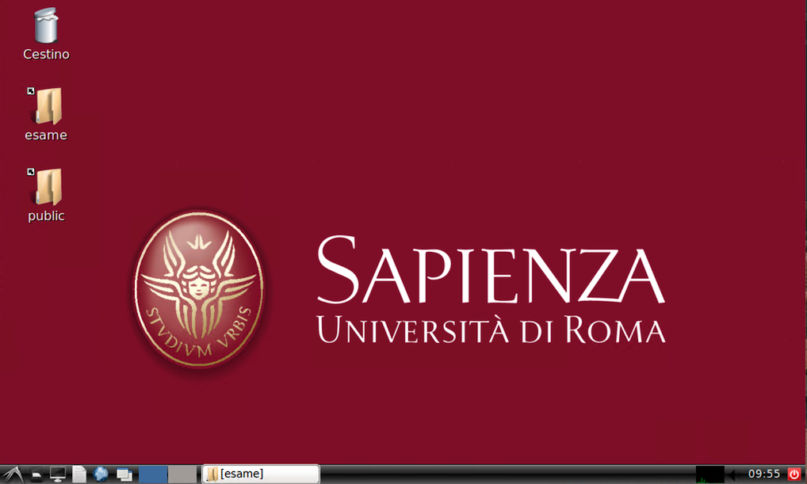
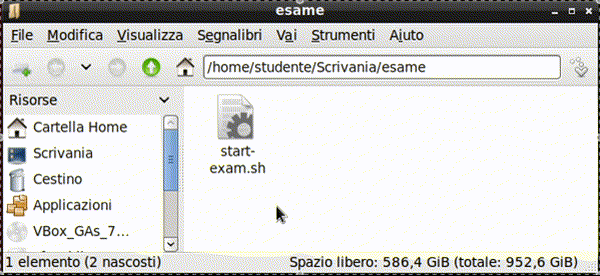
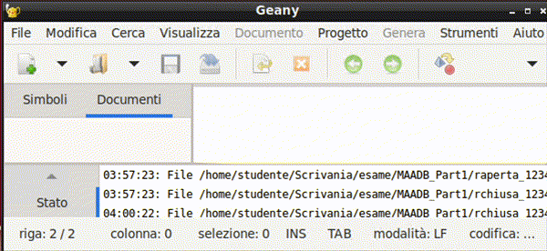
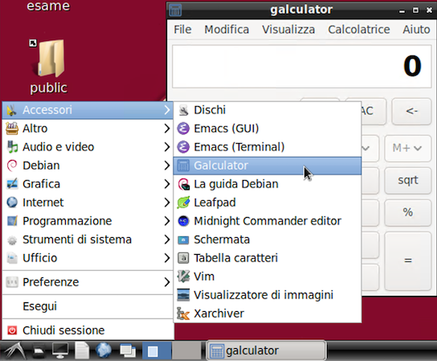

# Software e sistema operativo

!!!warning "Attenzione"
    Questa sezione è ancora in fase di revisione. Le informazioni qui contenute potrebbero non essere complete o aggiornate.

## Risorse per lo svolgimento dell'esame

### La cartella condivisa 'esami'

I file necessari per lo svolgimento della prova si troveranno nella cartella `esame`, di
cui è presente un link sul desktop.

All'inizio dell'esame, la cartella conterrà:

- una copia di questo documento in formato pdf (`istruzioni.pdf`).
- Il formulario (`MAADB cheat sheet <versione>.pdf`)
- le tavole statistiche (`tavole_z_t_chi2_F.pdf`)

Inoltre, la cartella contiene uno script per avviare l'applicazione _Exam helper_
(`start-examhelper.sh`). **Nota bene**: di norma l'applicazione _Exam helper_ è già avviata. Lo
script serve per riavviarla in caso di chiusura accidentale.

Le tracce verranno distribuite mediante il server dell'aula e appariranno
nella cartella pochi secondi dopo la distribuzione (che verrà chiaramente annunciata dal
docente). Trattandosi di una condivisione di rete, il file manager potrebbe richiedere
un aggiornamento manuale della visualizzazione del contenuto della cartella, utilizzando
il menu `Visualizza > Ricarica cartella`

!!! tip  
    Per aggiornare il la visualizzazione del contenuto della cartella è possibile
    anche premere il tasto `F5`.

!!! tip  
    Per visualizzare più facilmente i nomi dei file, è possibile passare alla
    visualizzazion a lista utilizzando il menu `Visualizza > Modalità vista cartella >
    Vista lista dettagliata` oppure premendo la combinazione di tasti `CTRL`+`4`.

Successivamente, mediante il sistema di distribuzione d'aula, nella cartella verranno
aggiunte in successione due sottocartelle:

- `MAADB_Part1`: con i file necessari per la Parte 1 dell'esame (file `.m` e `.mat`)
- `MAADB_Part2`: con i file necessari per la Parte 2 dell'esame (file `pdf` e `.txt`)

In appendice è riportata la struttura completa della cartella esame.

Anche il ritiro avverrà tramite il server d'aula, e comprenderà tutti e soli i documenti
contenuti nella cartella 'esame'. Si raccomanda di non spostare altrove i propri
elaborati, per evitare che risultino non consegnati (e quindi non valutabili).

Quando il docente annuncia che sta per procedere al ritiro degli svolgimenti, accertarsi
di aver salvato i file e chiuso i documenti contenenti lo svolgimento (e se non più in
uso di aver chiuso l'editor -- Matlab o Geany).

### Le applicazioni da utilizzare

#### Matlab

_Matlab R2023b_ è installato sul PC e viene utilizzato per la Parte 1 dell'esame.

Di norma viene avviato utilizzando il pulsante "_Avvia Problemi in Matlab_" nell'applicazione _Exam helper_. L'applicazione _Exam helper_ procederà a:

- avviare Matlab
- impostare `MAADB_Part1` come cartella di lavoro del Matlab
- aggiungere al path di Matlab il toolbox di verifica formale, che include il _live script_
  `check_exam.mlx`
- copiare nella cartella di lavoro gli script contenuti nella sottocartella `templates`,
  modificandone il nome per includere il numero di matricola dello studente
- aprire nell'editor gli script descritti al punto precedente
- avviare il _live script_ `check_exam.mlx`, che consente di verificare lo stato di avanzamento
  dello svolgimento e di eseguire le verifiche formali sulle variabili.

E' sempre possibile avviare Matlab senza fare uso dello script, ma in questo caso è
necessario eseguire manualmente le stesse operazioni di configurazione, che sono
descritte nella sezione  
[Malfunzionamento della procedura automatica di avvio dei problemi in Matlab](./troubleshooting.md#malfunzionamento-della-procedura-automatica-di-avvio-dei-problemi-in-matlab)  
in Appendice.

#### Geany (editor di testo)

_Geany_ è l'editor di testo utilizzato per la Parte 2 dell'esame.

L'applicazione:

- mostra chiaramente quali file non sono ancora stati salvati (tab di colore rosso)
- mostra nella barra di stato il numero di caratteri del testo selezionato

!!!tip  
    Per lo svolgimento della prova, è opportuno modificare la visualizzazione in modo che
    il testo venga visualizzato su più righe, senza che le righe superino il margine destro
    dello schermo. A questo fine, è necessario attivare il _word wrap_ (menu **View -\>
    Word Wrap**).

    

!!!tip  
    Se all'avvio oltre ai documenti di testo vengono visualizzati ulteriori pannelli, è possibile nasconderli trascinandone il bordo verso il margine.

    

Di norma viene avviato utilizzando il pulsante "_Avvia Quesiti a Risposta Chiusa_" o "_Avvia Quesiti a Risposta Aperta_" nell'applicazione _Exam helper_. L'applicazione _Exam helper_ procederà a:

- copiare nella cartella di lavoro i documenti di testo contenuti nella sottocartella
  `templates`, modificandone il nome per includere il numero di matricola dello studente
- aprire nell'editor gli script descritti al punto precedente

#### xPDF (visualizzatore di file pdf) -- OBSOLETO

!!!warning "Sezione in revisione"
    I file pdf saranno aperti nel browser web.

#### galculator (calcolatrice)

_galculator_ è la calcolatrice predefinita sui PC d'esame. Si trova nel menu delle applicazioni del sistema operativo, sottomenu "Accessori".

