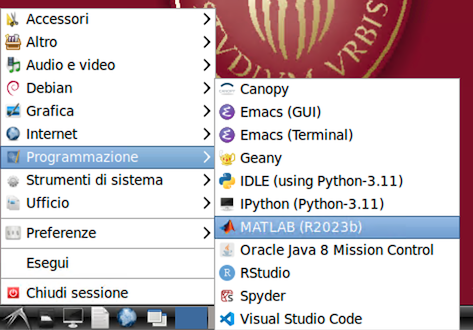
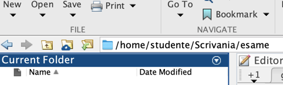

# Appendice

!!!warning "Attenzione"
    Questa sezione è ancora in fase di revisione. Le informazioni qui contenute potrebbero non essere complete o aggiornate.

## Appendice - Risoluzione problemi tecnici

Gli script di avvio e consegna delle prove sono stati verificati sulle
postazioni di esame e dovrebbero funzionare correttamente. Tuttavia, in caso di
problemi, è sempre possibile procedere manualmente (come del resto veniva fatto
dagli studenti degli anni accademici precedenti).

### Creazione manuale file di svogimento da template

Sia per la Parte 1 che per la Parte 2 dell'esame, [prima di aprire le tracce]{.underline} è necessario rinominare tutti i file che nel nome contengono il segnaposto 'MATRICOLA', che va sostituito con il proprio numero di matricola.

È importante accertarsi che il numero di matricola nel nome del file sia corretto e che non siano stati inavvertitamente modificati i caratteri precedenti e seguenti ("_" e ".").

Sia per la Parte 1 che per la Parte 2 dell'esame, [prima di aprire le
tracce]{.underline} è necessario **rinominare** tutti i file che nel
nome contengono il segnaposto 'MATRICOLA', che va sostituito con il
proprio numero di matricola.

È importante accertarsi che il numero di matricola nel nome del file sia
corretto e che non siano stati inavvertitamente modificati i caratteri
precedenti e seguenti (`_` e `.`).

### Malfunzionamento dello script avvia-problemi.sh

La procedura riportate di seguito è necessaria solo in caso di malfunzionamento dello script di avvio. In condizioni normali, è sufficiente eseguire lo script `avvia-problemi.sh` presente nella cartella `MAADB_Part1`.

#### 1. Avvio Matlab

L'applicazione può essere lanciata utilizzando menu delle applicazioni del sistema
operativo, sottomenu "Programmazione".



#### 2. Impostazione della cartella di lavoro

Una volta lanciato il Matlab, è necessario
cambiare la cartella di lavoro in modo che nel file browser integrato
sia visualizzato il contenuto della cartella `MAADB_Part1` presente nella
cartella `esame` sul desktop.

Per spostarsi nella cartella `MAADB_Part1` è possibile navigare tra le
cartelle del sistema operativo tramite il file browser di Matlab.
Il percorso completo della cartella è `/home/studente/Scrivania/esame/MAADB_Part1`.



!!! warning "Attenzione"  
    Un errore comune è spostarsi nella cartella `Esame` e da qui
    utilizzare il file browser per *visualizzare* il contenuto della sottocartella
    `MAADB_Part1`. In questo caso, Matlab non sarà in grado di eseguire gli script
    dell'esame perché non sono nella cartella corrente.

!!! note "Percorso di rete equivalente"  
    E' normale che nella barra di navigazione il
    percorso visualizzato sia `/media/sf_esame/MAADB_Part1`. Infatti, il percorso
    `/home/studente/Scrivania/esame/MAADB_Part1` è un collegamento simbolico al percorso
    `/media/sf_esame/MAADB_Part1`.

!!! tip "procedure alternative"  
    Per impostare la cartella di lavoro di Matlab, è anche possibile: 
    - utilizzare nella Command Window il comando `cd /media/sf_esame/MAADB_Part1`
    - incollare nella barra di navigazione il percorso della cartella.

#### 3. Configurazione del toolbox di verifica formale

Per configurare il toolbox di verifica formale, è necessario eseguire il
comando `startup_exam` nella *command window* di Matlab, seguito dal tasto INVIO.
(In alternativa, è possibile aprire il file `startup_exam.m` nell'editor *senza modificarlo* e cliccare sull'icona 'Run').
Al termine dell'esecuzione, verrà aperto automaticamente il *live script* di verifica formale
`check_exam.mlx`, che consente di verificare lo stato di avanzamento dello svolgimento e di
eseguire le verifiche formali sui file e sulle variabili.

### Malfunzionamento dello script avvia-rchiusa.sh e/o avvia-raperta.sh

In caso di malfunzionamento dello script `avvia-rchiusa.sh` e/o `avvia-raperta.sh`, è possibile procedere manualmente come segue:

1. Aprire il file `MAADB_2024-09_rchiusa_MATRICOLA.txt` e/o `MAADB_2024-09_raperta_MATRICOLA.txt` nell'editor di testo *Geany*.
2. Rinominare il file sostituendo 'MATRICOLA' con il proprio numero di matricola.
3. Aprire il file `domande-rchiusa.pdf` e/o `domande-raperta.pdf` con l'applicazione *xPDF*.
4. Aprire il file `MAADB_2024-09_rchiusa_MATRICOLA.txt` e/o `MAADB_2024-09_raperta_MATRICOLA.txt` nell'editor *Geany*.
5. Modificare il file di testo in modo da rispondere alle domande, seguendo le istruzioni contenute nel file PDF.

### Malfunzionamento degli scritpt di consegna

In caso di malfunzionamento dello script `consegna-problemi.sh`, `consegna-rchiusa.sh` e/o `consegna-raperta.sh`,
non è necessario eseguire alcuna operazione manuale. Gli svolgimenti dei problemi in Matlab e delle risposte ai quesiti a risposta chiusa e aperta saranno comunque consegnati automaticamente al termine dell'esame, quando il docente procederà al ritiro degli elaborati.
Non sarà però disponibile allo studente la visualizzazione nel browser degli svolgimenti consegnati.
E' necessario comunque avvisare i docenti del malfunzionamento, in modo che sappiano di non poter utilizzare alcune delle funzioni connesse alla verifica della consegna degli svolgimenti.

### Come aprire manualmente i file pdf


Purtroppo, sulla postazione di esame
l'applicazione di default per I file pdf è *Libre Office*, che [non
restituisce una visualizzazione corretta]{.underline} del file. È quindi
importante **non aprire i file pdf mediante un doppio click**. È invece
necessario utilizzare l'applicazione xPDF.

A questo fine, eseguire un *click-destro* sul file pdf e
selezionare xPDF dal menu contestuale.

<!-- {width="0.7513888888888889in"
height="0.5631944444444444in"} -->

<!-- [](./img/media/image2.jpeg) -->


Se questo file è erroneamente aperto
nell'applicazione *Libre Office*, chiudere l'applicazione e riaprire il
file con l'applicazione **xPdf**.

### Come aprire manualmente i file txt

!!! todo "Da completare"
  Questa sezione deve ancora essere completata. Aggiungere le istruzioni mancanti qui.
|
|

## Struttura della cartella 'esame'

La cartella 'esame' contiene i file necessari per lo svolgimento della prova. La
struttura della cartella alla chiusura dell'esame è la seguente:

```plain
esame/
├── istruzioni.pdf
├── MAADB_cheat_sheet_<versione>.pdf
├── tavole_z_t_chi2_F.pdf
├── start-exam.sh                           (*)
├── student_<lastname>.<matricola>          (1)
├── MAADB_Part1/
│   ├── 1-avvia-problemi.sh
│   ├── 2-consegna-problemi.sh
│   ├── startup.m                           (*)
│   ├── matfiles/
│   │   ├── <problem-data>.mat
│   │   ├── <problem-data>.mat
│   │   └── ...
│   ├── problema1_<matricola>.m             (2)
│   ├── ...                                 (2)
│   ├── problema<n>_<matricola>.m           (2)
│   └── submitted/                          (3)
│       ├── presubmission_checks_<matricola>_<timestamp>.html
│       ├── problema1_<matricola>_<timestamp>.html
│       ├── ...
│       └── problema<n>_<matricola>_<timestamp>.html
└── MAADB_Part2/
    ├── 1-avvia-rchiusa.sh
    ├── 2-consegna-rchiusa.sh
    ├── 3-avvia-raperta.sh
    ├── 4-consegna-raperta.sh
    ├── domande-rchiusa.pdf
    ├── domande-raperta.pdf
    ├── rchiusa_<matricola>.txt             (4)
    ├── raperta_<matricola>.txt             (6)
    └── submitted/
        ├── rchiusa_<matricola>.txt         (5)
        └── raperta_<matricola>.txt         (7)

(1) Creato dopo l'identificazione dello studente
(2) Creato dallo script `avvia-problemi.sh` a partire dai template problema*_MATRICOLA.m
(3) Cartella e contenuto creati dallo script `consegna-problemi.sh` dopo la consegna
(4) Creato dallo script `avvia-rchiusa.sh` a partire dal template rchiusa_MATRICOLA.txt
(5) Creato dallo script `consegna-rchiusa.sh` dopo la consegna
(6) Creato dallo script `avvia-raperta.sh` a partire dal template raperta_MATRICOLA.txt
(7) Creato dallo script `consegna-raperta.sh` dopo la consegna
(*) Di norma questi file possono essere ignorato. Vengono utilizzati in caso di 
    malfunzionamento delle procedure usuali.
```
<!-- 
Struttura della cartella 'esame' con sottocartelle `templates/`
esame/
├── istruzioni.pdf
├── MAADB_cheat_sheet_<versione>.pdf
├── tavole_z_t_chi2_F.pdf
├── start-exam.sh                           (*)
├── student_<lastname>.<matricola>          (1)
├── MAADB_Part1/
│   ├── 1-avvia-problemi.sh
│   ├── 2-consegna-problemi.sh
│   ├── startup.m                           (*)
│   ├── templates/
│   │   ├── problema1_MATRICOLA.m
│   │   ├── ...
│   │   └── problema<n>_MATRICOLA.m
│   ├── matfiles/
│   │   ├── <problem-data>.mat
│   │   ├── <problem-data>.mat
│   │   └── ...
│   ├── problema1_<matricola>.m             (2)
│   ├── ...                                 (2)
│   ├── problema<n>_<matricola>.m           (2)
│   └── submitted/                          (3)
│       ├── presubmission_checks_<matricola>_<timestamp>.html
│       ├── problema1_<matricola>_<timestamp>.html
│       ├── ...
│       └── problema<n>_<matricola>_<timestamp>.html
└── MAADB_Part2/
    ├── 1-avvia-rchiusa.sh
    ├── 2-consegna-rchiusa.sh
    ├── 3-avvia-raperta.sh
    ├── 4-consegna-raperta.sh
    ├── domande-rchiusa.pdf
    ├── domande-raperta.pdf
    ├── templates/
    │   ├── rchiusa_MATRICOLA.txt
    │   └── raperta_MATRICOLA.txt
    ├── rchiusa_<matricola>.txt             (4)
    ├── raperta_<matricola>.txt             (6)
    └── submitted/
        ├── rchiusa_<matricola>.txt         (5)
        └── raperta_<matricola>.txt         (7)

 -->